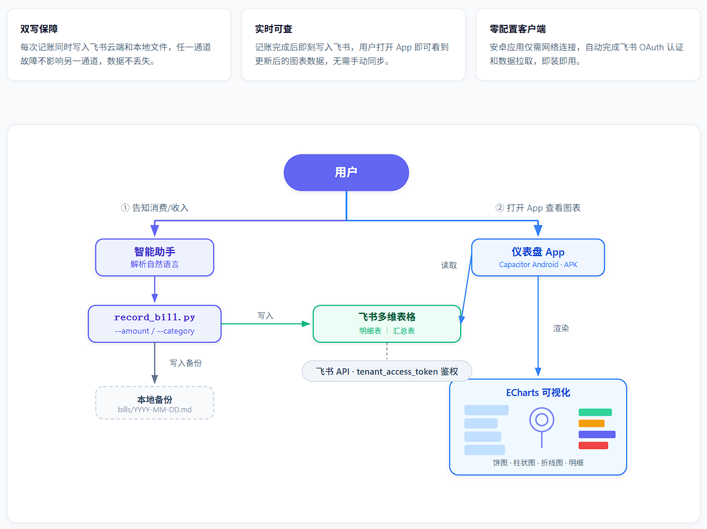
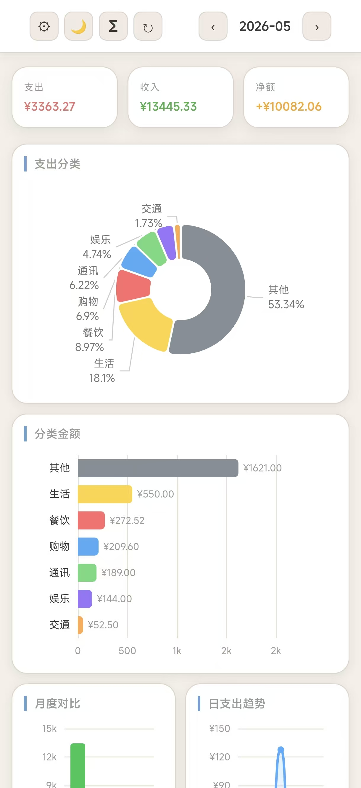
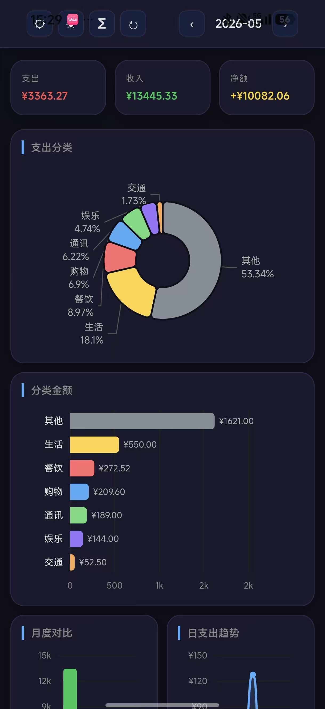
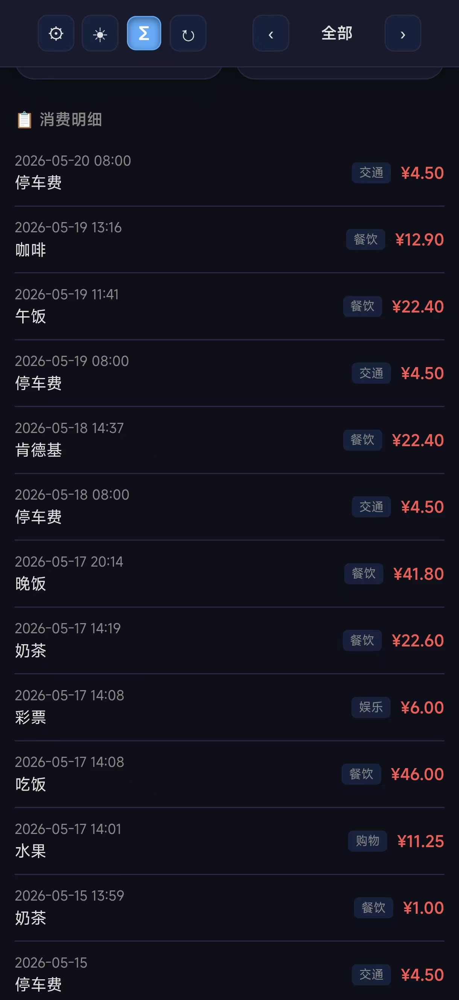
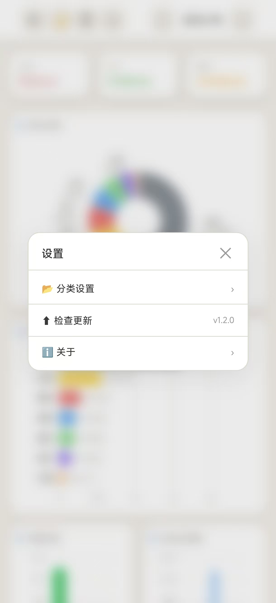

# 🤖 Agent记账App


本系统实现了一个完整的个人财务记账闭环：用户通过自然语言与智能助手交互完成记账录入，并通过移动端应用查看可视化的财务数据分析。

**核心原理**：智能助手（Agent）通过记账 Skill 调用飞书 CLI，在多维表格上完成记账；App 通过飞书 API 读取数据并渲染为图表。用户只需动口，剩下的全自动。

怎么用？跟 AI 说就行。「午饭花了 23 块 4」自动归到餐饮，「工资到账 8000」归到工资。Agent 帮你分好类、写好表、同步完，App 那边自动渲染成图表。数据在你自己的飞书里，不经过第三方服务器。

安装包仅 3.9 MB，每次刷新走 55KB 流量。没广告、没订阅、不用注册。

---

## 项目优势

| 优势 | 说明 |
|------|------|
| **零服务器** | 数据直接存放在飞书多维表格中，无需购买和维护云服务器 |
| **只装一个 APK** | Android 设备安装一个 APK 即可使用，无需配置运行环境 |
| **AI 全自动记账** | 对 AI 说出消费金额，自动完成分类、同步和统计 |
| **AI 引导配置** | 创建飞书应用、开通权限、搭建数据表格，全程由 AI 引导完成 |
| **飞书即后台** | 多维表格本身就是数据库，App 和飞书网页均可随时查阅 |
| **数据自主可控** | 账单数据存储在你自己的飞书账号中，不经过任何第三方服务器 |

**使用门槛：只有一个**——需要一个能运行 Skill 的 AI 助手（如 OpenClaw、Hermes Agent）。手机安装 APK，AI 安装 Skill，即可开始使用。

---

## 功能

| 功能 | 说明 |
|------|------|
| **自然语言记账** | 「早饭花了 12 元」「工资到账 8000」——直接说人话即可完成记账 |
| **图片记账** | 截图或拍照发送给 AI，自动识别金额并完成记账 |
| **支出分类占比** | 环形图直观展示各支出分类的比例构成 |
| **分类金额排行** | 横向柱状图按金额从高到低排列各分类支出 |
| **月度收支对比** | 柱状图对比近六个月的收入和支出变化 |
| **日支出趋势** | 折线图展示当月每日支出波动，帮助掌握消费节奏 |
| **消费明细** | 每笔消费按时间倒序排列，支持按月筛选和回溯 |
| **浅色/深色主题** | 默认浅色主题，支持一键切换深色模式 |
| **飞书同步** | 每笔记账实时写入飞书多维表格，App 打开即见最新数据 |

---

## 系统架构

<p align="center">
  
</p>

系统由四个分层构成：

**用户层** — 用户通过两种方式与系统交互：告知智能助手消费或收入信息、打开移动端 App 查看可视化报表。

**Agent 与脚本层** — 智能助手接收自然语言后自动解析金额、类别、备注等关键信息，调用记账脚本 `record_bill.py` 完成数据写入。

**数据层** — 每笔账单同时写入飞书多维表格和本地文件系统，实现双写保障。

**可视化层** — 安卓应用通过飞书 API 拉取多维表格数据，经由 ECharts 渲染为饼图、柱状图、折线图等可视化图表。

---

## 界面预览

<p align="center">
  
  
  
  
</p>

<p align="center">
  <em>月度总览 · 分类金额与趋势 · 消费明细 · 设置界面</em>
</p>

---

## ⬇️ 下载 APK

> **Android 用户直接安装，再复制下方的Skill提示给任意Agent完成首次配置**

**[📦 点击下载 APK](https://github.com/NaeemTC/feishu-accounting-skill/releases/latest/download/app-release.apk)**（3.9 MB）

> 如果链接失效，请访问 [Releases 页面](https://github.com/NaeemTC/feishu-accounting-skill/releases) 下载最新版本。

---

## 🔧 安装 Skill（给 AI 助手用）

想让你的 Agent 帮你记账？把下面这句话丢给它就行，剩下的它自己来：

```
帮我安装这个记账技能，项目地址：https://github.com/NaeemTC/feishu-accounting-skill

这是一个飞书多维表格记账系统，支持自然语言记账、图片记账、月度统计、分类分析。数据存在你自己的飞书里，不需要服务器。
```

> AI 收到后会读取仓库里的 `skills/feishu-accounting/SKILL.md`，然后装技能、引导你建飞书应用、配好凭证、开始记账。全程对话搞定，不用自己动手配。

如果你用的Agent支持技能安装链接，也可以直接丢这个链接给它：

```
https://github.com/NaeemTC/feishu-accounting-skill/tree/main/skills/feishu-accounting
```

---

## ⚙️ 配置飞书

本 App 的数据存在飞书多维表格里，需要配置飞书应用才能使用。

### 方式一：让 AI 帮你一键配置（推荐）

已经装好 Skill 后，直接对 AI 说：

```
我想用飞书记账
```

AI 会自动引导你完成以下步骤，全程不需要手动操作飞书网页：

1. 安装飞书 CLI 工具
2. 创建飞书自建应用（获取 App ID + App Secret）
3. 开通多维表格权限
4. 在飞书里创建表格，自动配置好所有字段
5. 把 base_token 和 table_id 配置到 App

### 方式二：手动配置

如果你想自己配，请参考 [飞书多维表格记账系统配置指南](skills/feishu-accounting/SKILL.md) 的 Setup 部分。

---

## 🛠️ 技术栈

| 层级 | 技术 |
|------|------|
| App 框架 | Capacitor 8.x（Android） |
| 前端 | Vanilla TypeScript + Vite |
| 图表 | ECharts 6.x（SVG 渲染） |
| 数据 | 飞书多维表格 Base API v3 |
| AI 记账 | Hermes Agent + record_bill.py |
| 主题 | CSS 变量 + data-theme 属性，localStorage 持久化 |

---

## 📂 项目结构

```
feishu-accounting-skill/
├── android/                 # Capacitor Android 项目
├── dist/                    # Web 构建产物（单文件 index.html）
├── skills/
│   └── feishu-accounting/   # AI 记账 skill
│       ├── SKILL.md         # 完整配置 + 使用说明
│       ├── scripts/
│       │   └── record_bill.py  # 记账核心脚本
│       └── references/
│           └── categories.md   # 分类关键词参考
├── assets/
│   └── images/              # App 截图 + 图标
├── build.sh                 # debug 构建脚本
├── sync.sh                  # release 构建脚本
├── capacitor.config.json
└── README.md
```

---

## 🔧 开发者

### Build APK

```bash
git clone https://github.com/NaeemTC/feishu-accounting-skill.git
cd feishu-accounting-skill
npm install
npx cap sync android
# Release 版
bash sync.sh
# 或 Debug 版
bash build.sh
# APK 输出到 android/app/build/outputs/apk/
```

---

## 🔒 隐私声明

本 App 不会收集、上传或共享你的任何个人信息。

### 网络请求

| 目标 | 目的 | 传输数据 |
|------|------|----------|
| `cdn.jsdelivr.net` | 加载 ECharts 图表库 | 无（仅加载 JS 文件） |
| `open.feishu.cn/open-apis/auth/v3/tenant_access_token/internal` | 获取飞书 API Token | App ID + App Secret（换取 2 小时有效令牌） |
| `open.feishu.cn/open-apis/base/v3/bases/{base}/tables/{table}/records` | 拉取账单数据 | Bearer Token（飞书 API 鉴用） |

### 权限

仅需 `INTERNET` 权限（联网获取飞书数据）。无相机、定位、通讯录、存储、短信等敏感权限。

### 数据存储

所有配置（App ID / Secret / Base Token / Table ID）仅存于本机 WebView 的 `localStorage`，**不发送给任何第三方服务器**。数据实时从你的飞书多维表格读取，不经由第三方中转。

### 第三方依赖

- ECharts（`cdn.jsdelivr.net` 加载）— 仅用于图表渲染，不收集任何用户数据

### 透明度

本 App 无广告、无统计埋点、无推送通知、无后台服务。关闭即停止所有网络活动。

---

## 📄 License

MIT

---


