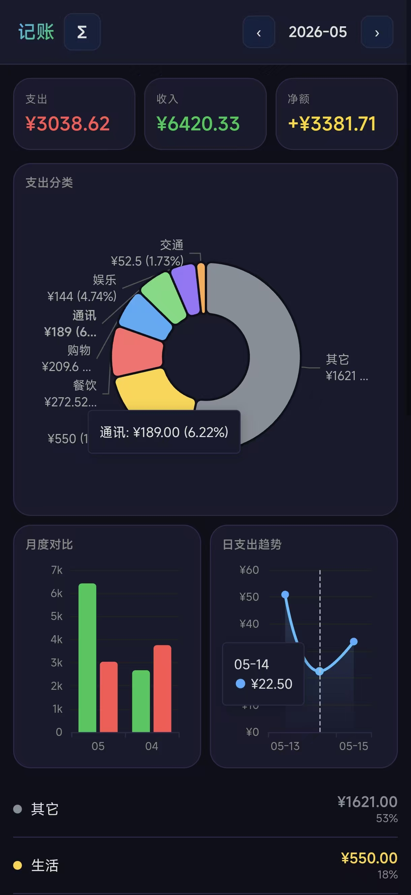

# 🤖 飞书 AI 记账

用自然语言记账的 Android App，数据存在飞书多维表格里，AI 帮你记、帮你算、帮你看。



---

## ✨ 功能

| 功能 | 说明 |
|------|------|
| 📝 **自然语言记账** | 「早饭花了 12 元」「工资到账 8000」直接说，AI 自动识别分类 |
| 📷 **图片记账** | 截图/拍照发过来，AI 识别金额直接记 |
| 📊 **月度统计** | 收入/支出/净额一目了然 |
| 🥧 **分类饼图** | 各类支出占比，清楚知道钱花哪儿了 |
| 📈 **日趋势折线图** | 每天花了多少，折线图一目了然 |
| 📋 **明细列表** | 每笔记账随时可查 |
| 🔄 **飞书同步** | 本地记录实时同步到飞书多维表格，永不丢失 |

---

## 📱 界面预览


---

## ⬇️ 下载 APK

> **Android 用户直接安装，无需任何配置**

**[📦 点击下载 APK](assets/app-release.apk)**（3.9 MB）

安装后打开 App，绑定你的飞书多维表格（配置教程见下方「配置飞书」），即可开始使用。

> 如果无法直接下载，请访问 [Releases 页面](https://github.com/NaeemTC/ai-assistant-accounting/releases) 下载最新版本。

---

## ⚙️ 配置飞书（AI 自动引导）

本 App 的数据存在飞书多维表格里，需要配置飞书应用才能使用。

### 方式一：让 AI 帮你一键配置（推荐）

如果你有一个 AI 助手（基于 Hermes Agent），直接对它说：

```
我想用飞书记账
```

AI 会自动引导你完成以下步骤，全程不需要手动操作飞书网页：

1. 安装飞书 CLI 工具
2. 创建飞书自建应用（获取 App ID + App Secret）
3. 开通多维表格权限
4. 在飞书里创建「明细表」和「汇总表」，自动配置好所有字段
5. 把 base_token 和 table_id 配置到 App

### 方式二：手动配置

如果你想自己配，请参考 [飞书多维表格记账系统配置指南](skills/feishu-accounting/SKILL.md)。

---

## 🛠️ 技术栈

| 层级 | 技术 |
|------|------|
| App 框架 | Capacitor 8.x（Android） |
| 前端 | Vanilla TypeScript + Vite |
| 图表 | ECharts 6.x |
| 数据 | 飞书多维表格 Base API v3 |
| AI 记账 | Hermes Agent + record_bill.py |

---

## 📂 项目结构

```
ai-assistant-accounting/
├── android/                 # Capacitor Android 项目
├── dist/                    # Web 构建产物
├── skills/
│   └── feishu-accounting/   # AI 记账 skill
│       ├── SKILL.md         # 完整配置 + 使用说明
│       ├── scripts/
│       │   └── record_bill.py  # 记账核心脚本
│       └── references/
│           └── categories.md   # 分类关键词参考
├── assets/
│   ├── images/              # App 截图
│   └── app-release.apk      # 最新 APK
└── README.md
```

---

## 🔧 开发者

### Build APK

```bash
git clone https://github.com/NaeemTC/ai-assistant-accounting.git
cd ai-assistant-accounting
npm install
npx cap sync android
npx cap build android
# APK 输出到 android/app/build/outputs/apk/release/app-release.apk
```

### 安装 Skill（给 AI 助手用）

```bash
# 把 skill 目录复制到 AI 助手的数据目录
cp -r skills/feishu-accounting ~/.hermes/skills/

# 配置环境变量（在 ~/.bashrc 里加）
export FEISHU_BASE_TOKEN="你的base_token"
export FEISHU_DETAIL_TABLE_ID="你的明细表ID"
export FEISHU_SUMMARY_TABLE_ID="你的汇总表ID"
```

---

## 📄 License

MIT
