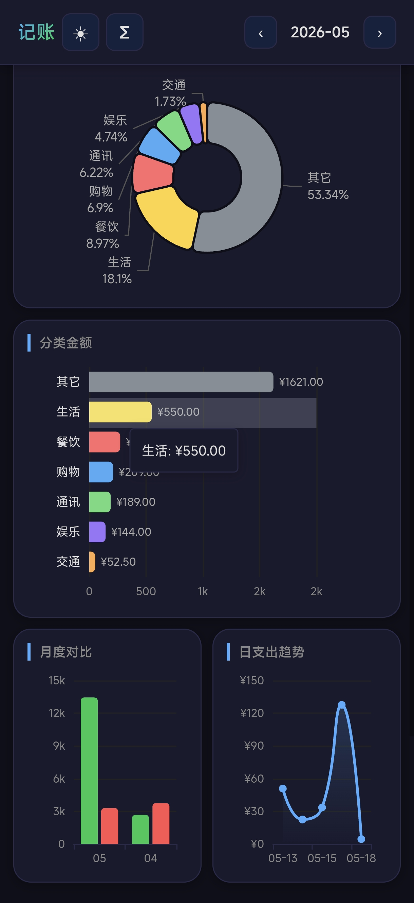

# 🤖 飞书 AI 记账


用自然语言记账的 Android App，数据存在飞书多维表格里，AI 帮你记、帮你算、帮你看。

---

## 🌟 项目优势

| 优势 | 说明 |
|------|------|
| 🖥️ **零服务器** | 不需要买云服务器，所有数据存在飞书多维表格里 |
| 📱 **只装一个 APK** | Android 用户直接装 APK，无需配置任何环境 |
| 🤖 **AI 全自动** | 告诉 AI「记账」两个字，剩下的交给 AI：自动分类、自动同步、自动统计 |
| 🔧 **AI 帮你配置** | 飞书多维表格的创建、字段配置、权限开通，全部由 AI 自动引导完成 |
| 📊 **飞书即后台** | 飞书多维表格就是你的数据后台，在手机 App 和网页端都能看 |
| 🔒 **数据自主可控** | 数据存在自己的飞书里，不依赖任何第三方服务器 |

**使用门槛：只有一个**——有一个能跑 Skill 的 AI 助手（如 OpenClaw、Hermes Agent）。手机装 APK，AI 装 Skill，就能用了。

---

## ✨ 功能

| 功能 | 说明 |
|------|------|
| 📝 **自然语言记账** | 「早饭花了 12 元」「工资到账 8000」直接说，AI 自动识别分类 |
| 📷 **图片记账** | 截图/拍照发过来，AI 识别金额直接记 |
| 🥧 **支出分类占比** | 环形图展示各类支出占比，清楚知道钱花哪儿了 |
| 📊 **分类金额排行** | 横向柱状图按金额排名，一眼看出哪些类花得多 |
| 📈 **月度收支对比** | 柱状图对比本月与上月收支，趋势一目了然 |
| 📉 **日支出趋势** | 折线图看每天花了多少，波动一眼掌握 |
| 📋 **消费明细** | 每笔记账按时间倒序排列，随时可查 |
| 🌗 **浅色/深色主题** | 默认浅色自然风，一键切换深色模式，适配不同使用场景 |
| 🔄 **飞书同步** | 本地记录实时同步到飞书多维表格，永不丢失 |

---

## 📱 界面预览

<p align="center">
  
  
  
</p>

<p align="center">
  <em>左：浅色主题全览 · 中：深色主题图表 · 右：消费明细</em>
</p>

---

## ⬇️ 下载 APK

> **Android 用户直接安装，无需任何配置**

**[📦 点击下载 APK](https://github.com/NaeemTC/ai-assistant-accounting/releases/latest/download/app-release.apk)**（3.9 MB）

> 如果链接失效，请访问 [Releases 页面](https://github.com/NaeemTC/ai-assistant-accounting/releases) 下载最新版本。

---

## 🔧 安装 Skill（给 AI 助手用）

如果你有自己的 AI 助手（基于 Hermes Agent），可以安装记账 Skill，让 AI 帮你完成飞书配置和日常记账：

```bash
# 把 skill 目录复制到 AI 助手的数据目录
cp -r skills/feishu-accounting ~/.hermes/skills/

# 在 skill 目录下创建 .env 文件（record_bill.py 会自动加载）
cat > ~/.hermes/skills/feishu-accounting/.env << 'EOF'
FEISHU_BASE_TOKEN="你的base_token"
FEISHU_DETAIL_TABLE_ID="你的明细表ID"
FEISHU_SUMMARY_TABLE_ID="你的汇总表ID"
EOF
```

详细配置说明见 [feishu-accounting/SKILL.md](skills/feishu-accounting/SKILL.md)。

---

## ⚙️ 配置飞书

本 App 的数据存在飞书多维表格里，需要配置飞书应用才能使用。

### 方式一：让 AI 帮你一键配置（推荐）

直接对 AI 助手说：

```
我想用飞书记账
```

AI 会自动引导你完成以下步骤，全程不需要手动操作飞书网页：

1. 安装飞书 CLI 工具
2. 创建飞书自建应用（获取 App ID + App Secret）
3. 开通多维表格权限
4. 在飞书里创建「明细表」和「汇总表」，自动配置好所有字段
5. 把 base_token 和 table_id 配置到 App

### 方式二：手动配置

如果你想自己配，请参考 [飞书多维表格记账系统配置指南](skills/feishu-accounting/SKILL.md) 的 Setup 部分。

---

## 🛠️ 技术栈

| 层级 | 技术 |
|------|------|
| App 框架 | Capacitor 8.x（Android） |
| 前端 | Vanilla TypeScript + Vite |
| 图表 | ECharts 6.x（SVG 渲染） |
| 数据 | 飞书多维表格 Base API v3 |
| AI 记账 | Hermes Agent + record_bill.py |
| 主题 | CSS 变量 + data-theme 属性，localStorage 持久化 |

---

## 📂 项目结构

```
ai-assistant-accounting/
├── android/                 # Capacitor Android 项目
├── dist/                    # Web 构建产物（单文件 index.html）
├── skills/
│   └── feishu-accounting/   # AI 记账 skill
│       ├── SKILL.md         # 完整配置 + 使用说明
│       ├── scripts/
│       │   └── record_bill.py  # 记账核心脚本
│       └── references/
│           └── categories.md   # 分类关键词参考
├── assets/
│   └── images/              # App 截图 + 图标
├── build.sh                 # debug 构建脚本
├── sync.sh                  # release 构建脚本
├── capacitor.config.json
└── README.md
```

---

## 🔧 开发者

### Build APK

```bash
git clone https://github.com/NaeemTC/ai-assistant-accounting.git
cd ai-assistant-accounting
npm install
npx cap sync android
# Release 版
bash sync.sh
# 或 Debug 版
bash build.sh
# APK 输出到 android/app/build/outputs/apk/
```

---

## 📄 License

MIT
